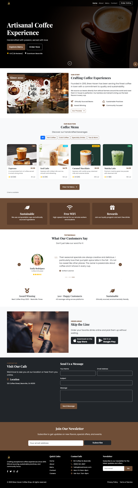

# Brew Haven Coffee Shop Website



A responsive website for an artisanal coffee shop featuring dark mode, interactive menu, and PWA capabilities.

## Features

- 🌓 Dark/Light mode with system preference detection
- ☕ Interactive coffee menu with filtering
- 🏆 Customer testimonials carousel
- 📝 Contact form with validation
- 📱 PWA-ready (installable, works offline)
- 🚀 Performance optimized

## Technologies Used

- HTML5, CSS3, JavaScript
- Bootstrap 5
- AOS (Animate On Scroll)
- WebP image format
- PWA technologies

## Live Demo
[View Live Demo](https://Waliyu23.github.io/brewhaven-coffee/)

## Installation

No installation required - just clone and open index.html:

```bash
git clone https://github.com/Waliyu23/brewhaven-coffee.git
cd brewhaven-coffee
